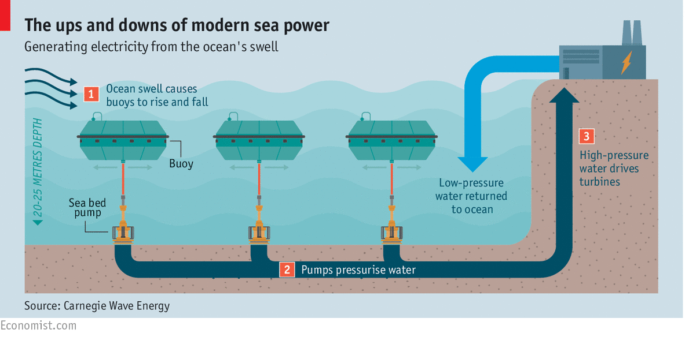
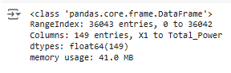
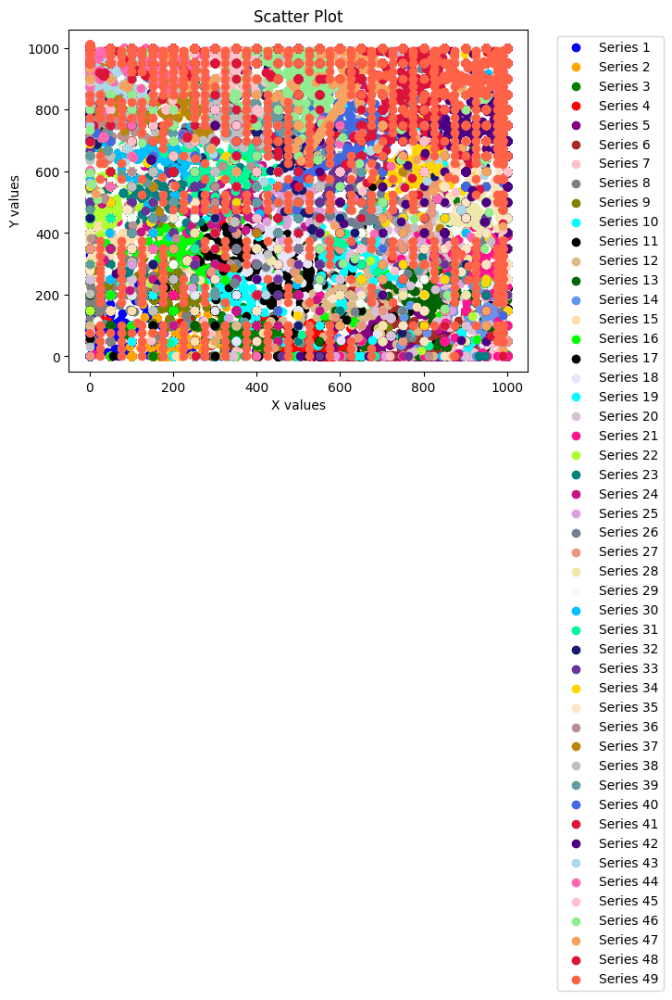
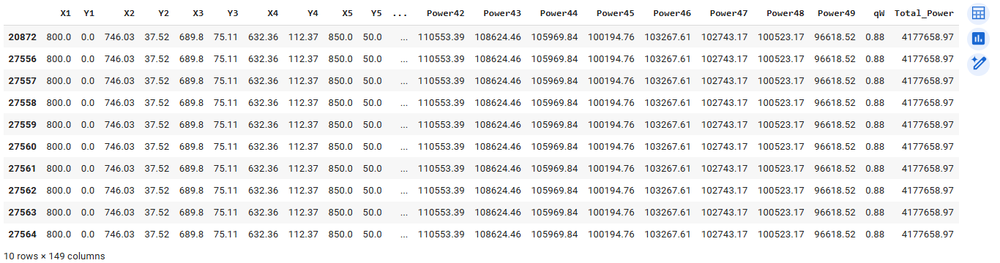
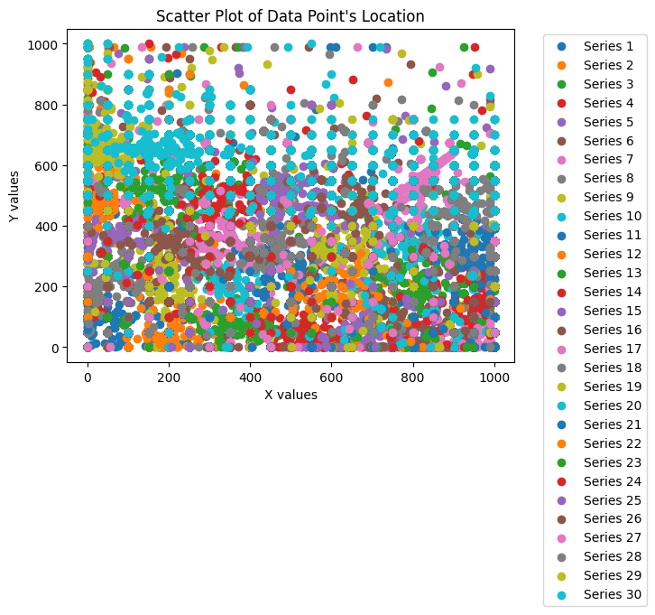

# Wave Energy Generation 
Data Mining Regression Project - Paula McCree-Bailey

### **Overview** 

The main goal of Project 3 is to work with a regression models. The goal is to create a blog that includes (1) an introduction to topic and dataset. Next, (2) discuss what regression is and how it works (specifically linear regression). Math for bonus points. Then, (3) discuss experiments with different types of regression. Lastly, (4) conclude with what you have learned from this project.

### **Introduction**

Fossil fuel can be a double-edged sword offering both positive and negative opportunities.  It can offer wealth to countries to fuel their economies and gasoline (plus byproducts) to offer mobility and comfort in the form of electricity for their citizens.  On the other hand, fossil fuel can be devastating to the environment if it is extracted incorrectly, and it is not an infinite resource.

A promising renewable energy resource is the use of wave farms to create energy.  The ocean covers 70% of the earth's surface.  It is also about 97% of all water on Earth.  The abundance of the oceans is a major reason to explore wave farming as an option for energy.

My project is based on the white paper [Optimisation of Large Wave Farms Using A Multi-Strategy Evolutionary Framework](https://drive.google.com/file/d/1WPVM3WzIP5SFv4GOJZVT6KZOgOme0ALp/view?usp=drive_link). The primary goal of their "research is to maximise the total harnessed power of a large wave farm consisting of fully submerged three-tether wave energy converters (WECs)." Specifically, the study looked at wave farms in Perth and Sydney, Australia which contained over twenty convertors. The research included six modern algorithms, four discrete search techniques and three hybrid optimization methods.

This regression project focuses on research on the Perth 49 converter wave farm.

##### **Perth Wave Power Project**
Perth Wave Power Project is an offshore development in Western Australia that went live in February 2015. At that time, the energy generated was able to power 3,500 households.  It is expected to reduce greenhouse gas emission by more than 500,000t over the life of the project.

The wave converters use large buoys tied to the sea floor by a rope.  As the buoy rises and falls with each passing wave, the rope tightens causes high pressures.  These pressures are piped to shore where it powers water desalination plants and produces electricity.

The goal is to predict the total power output based on the coordination of the wave energy converters (WECs) within a large wave farm.  By demonstrating the benefits of wave energy maybe we can change a few minds to invest in wave energy.

### **DataSet**

The data set was donated on September 16, 2023 to UC Irvine Machine Learning Repository. It includes 4 CSV files for wave energy converters farms based in Perth and Sydney, Australia.  Each city contains two files, one containing information on 49 wave energy converters (buoys) and another containing 100 wave energy converters. The total project contains 63,600 observations and 149 features.

The Perth Wave 49 dataset was used for this project.  It contains 36,044 observations and 149 features.

Each instance or observation represents the location of WECs in the wave farm plus the total power output and individual power of each converter and q-factor.

The features are :
*   X1,...,Xn are the X coordinates for the Xi buoy.

*   Y1,...,Yn  are the corresponding Y coordinates for the Yi buoy.
*   Power1,...,Powern is the Power generated by the buoy XiYi.
*   qW also called the q-factor is calculated as the ratio of the power generated by the entire wave farm to the sum of power outputs from all WECs if they operate in isolation but not in a farm. generated by the buoy XiYi. This feature was not clearly defined on the website but gleemed from the white paper.

 A values qW > 1 indicates this particular farm benefits from the constructive interaction between WECs, and more
energy can be generated if these WECs operate together.

*   Total Power is the total power generated by the buoys during the observational period.

[Large-scale Wave Energy Farm](https://archive.ics.uci.edu/dataset/882/large-scale+wave+energy+farm)

### **What is regression and how does it work?**

 Linear regression finds the best relationship using a straight line between an independent and dependent variable. This best fit line predicts the value of the dependent varible based on the independent variables and minimizes the differences between their predicted and actual values.  For this project, the dependent (target variable) is `Total_Power` and the other variables X1,...,Xn, Y1,...,Yn, Power1,...,Powern, and `qW` are the independent variables.

The compares results from five different forms of linear regression.

1.   Linear Regression using scikit-learn
2.   Linear Regression using ordinary least squared from statsmodel
3.   Random Forest Regression
4.   Gradient Descent Algorithm with standardization
5.   Ridge Regression

##### **Simple Linear Regression**
In linear regession, we are looking for a linear function that will predict the dependent feature (target) based on the independent features.  It is based on a line Yi = BiXi  + B0  which represents the degree of change in the dependent features for every unit of change in the independent variable  where
                            Bi is the slope,
                            Xi is the independent variable, and
                            B0 is the y -intercept (best line).
The accuracy of predicted values based on actual values are the coefficients of B0 and Bi .

##### **Linear Regression using Ordinary Least Squares**
 The  common method for finding the "best-fit" line is the use of ordinary least squares method.
1.   Calculate the Total Sum of Squares (SST) which is the difference between the mean value and the actual value squared and summed.

     SST = $$\sum_{i = 1}^n (y_i - ybar_i)^2$$
  
2.   Next by using ordinary least squares and basic equation for a line y = mx + b where
                            m is the slope,
                            x is the independent variable, and
                            b is the intercept (best line)
to find the minimum value for SSE by finding m and b.

        m = $$\frac{ \sum_{}(x_i - xbar_i)(y_i - ybar_i) \,}{\sum_{} (x_i - xbar_i)^2}$$

        y = ybar - m * xbar

                          x is the independent variable
                          xbar is the mean of independent variable
                          y is the dependent variable
                          ybar is te mean of dependent variable

3.  Finally, y = mx + b represents the line that best-fits our data.

As a note, unlike models such as gradient descent, ordinary least squares does not require standardization or normalization.

##### **Random Forest Regressor**
Random Forest algorithm creates multiple non correlated individual models (decision trees) which in the case of classification can vote on the best classification model.

Pros:
- Default ability to correct for overfitting to their training set by individual trees.
- Good results with imbalanced datasets
- Can handle huge amounts of data with high dimensional variables.

Cons:
- Random Forest is less efficient than a neural network
- To create those trees, it can use a lot of memory and be slower for large data sets.

The last three model unlike linear regression requires some form of transformation either by standardization or normalization.  The method selected depends on the type of data.

##### **Gradient Descent Algorithm with standardization**
Gradient descent algorithm is used to find the linear regression model for a multi-variate dataset. These data sets have one independent variable and multiple dependent variables.  The goal is to find the cost function which produces the minimum value. By applying different parameters to $theta_0$ and $theta_1$ and taking steps (learning rate) towards the minimum value.  If steps are too large, it's possible that the model could overshoot the minimum. If the step is too small, it could take a long time to reach the minimum value.  the process repeats until it reaches a convergence.

The model is able to identify the optimal value by taking large steps, when its far away from the desired value.  As it gets closer, it will begin to take smaller steps until it reaches the minimum value.

Steps:
1. Use the sum of squared residuals to determine how well a line fits the data.
2. Take the derivative of the sum of squared residuals.
3. Choose a random value for the intercept, then calculated the derivative based on the random intercept value.
4. The result (slope) is plugged into the step calculation, Step size = slope * learning rate
5. Calculate the new intercept.
New intercept = old intercept - step size.
6. Plug the new intercept into the derivative.
7. Repeat the process until the step size is close to zero.
8. Now we need to find the slope and intercept that give us the minimum sum of residuals. Take derivative with respect to slope. Take derivative with respect to the intercept.
9. Choose a random value for the slope and intercept which are plugged into the derivative of slope and derivative of intercept equations. The results are slopes.
10. Plug the slope into the step size formula.
11. Calculate the new intercept and new slope.
12. Repeat the process until the step size is very small or we reach our max number of step sizes of 1,000.

It is best to use standardization for normally distributed data.  It will transform the data so the mean is 0 and the standard deviation is 1 by shifting the data.  This removes bias from scaled differences in the data.

To standardize a feature $x$:

$$
x_{\text{standardized}} = \frac{x - \mu}{\sigma}
$$

Where:
- $x$ is an individual data point.
- $\mu$ is the mean of the feature.
- $\sigma$ is the standard deviation of the feature.

##### **Ridge Regression**
Ridge regression, known as L2 regularization, is a method that is better able to handle overfitting one of the shortcomings of linear regression.  It uses a penalty term named alpha to improve the ordinary least squares model.  This term is the sum of the squared coefficients. The larger alpha, the greater the shrinkage meaning coefficients are moving closer to 0.  This effectively reduced the complexity of the model.

##### **Lasso Regression**
Lasso regression, known as L1 regularization, is a method also handles overfitting well.  It uses adds a penalty term named alpha to improve the ordinary least squares model.  The penalty added is the absolute value of the coefficients which can cause some coefficients to be reduced to exactly zero. This effectively performs feature selection by reducing the effect of less important features.

### **Data understanding**

To better understand the data set, used `wave_df.describe()` and `wave_df.info` to look at the distribution and the shape. The data set contains 36,043 observations and 149 features. All features are a continous value.

**Before diving right into the work, what steps do you take to first gain an understanding of your data? For example, are any features correlated with each other? Are there any existing patterns? What visualizations can you make to help gain this initial understanding?**

The scatterplot above is interesting.  The points fill the chart as expected. There are underlying groupings of orange, blue, red, and yellow.  Overall, we can not see any patterns when using all data points. although, the color orange (series 49) has interesting vertical placement. 

A decision was made to view the points with the highest ten points that generate the highest level of `Total_Power` to see if we see any patterns in the data.  These observation would capture the best interacation between X1, Y1, ..., X49, and Y49.  After applying `wave_df.nlargest(10,'Total_Power')` to the data set, I was surprised to see that the top 10 observations with the best `Total_Power` seem to be duplications.

By removing the duplicate observations ` wave_df.drop_duplicates(keep='first')`, it reduced the data set from 36,044 to 10,936 observations. Initially, I was concerned about the duplications, but it made sense. The wave energy converters are floating in the ocean and unless there is a storm, a change in the location of the converter or change in the current, we should expect there to be limited changes in the energy generated.

Now, let’s look at the Total_Power for the top twenty observations (X1, Y2, … ,X49, and Y49) or first 980 data points. From this smaller sample, in general, the converters in locations between (X: 0 - 1000) and (Y: 0 - 300) as a collective produced the greatest amount of energy.

### **Experiment 1: Pre-processing**

From the initial data understanding, there are no null or missing values.  Also, confirmed those results with `wave_dups.isna().sum()` and `wave_dups.describe()` used above.

For the first experiment with linear regression, we used all features.  Just put everything into the model and see what happened.  Initially, I thought it would be necessary to create data points. For example, $(X_1,Y_1), (X_2,Y_2)$, etc.; however, after some research it is commonplace to leave data such as longitude and latitude in separate columns when modeling. All features are numerical, so it is not necessary to complete any transformations.  Also, with linear regression, the data does not need to be standardized or normalized.

### **Modeling**  
####**Experiment 1 -- Linear Regression with scikit-learn**

Documentation: https://scikit-learn.org/stable/modules/generated/sklearn.linear_model.LinearRegression.html

The first model used simple linear regression using scikit-learn and used all 148 features as predictors and `Total_Power` as the target variable. This model is the baseline model.

All models used the same testing and training set with a 80/20 split. Also, selected 21 for the `random_state` to control the randomness of operations, ensuring reproducibility. 

#### **Experiment 1: Evaluation**

Next, we created an instance for linear regression.  Afterwards, created the predictions and evaluated the model.

The R-squared ($R^2$), also known as the coefficient of determination, measures how well the independent variable(s) explains the variance in the dependent (target) variable. The $R^2$ for basic linear regression was 99.9% which seems great but linear regression is known for overfitting.  Another method of checking the performance is with Mean Squared Error (MSE).

The MSE measures the average squared difference between the predicted and actual values.  For this model, the result was 78832.66.  This does not seem like a high value, but we will compare it to the other models.

Experiment 2 -- Ordinary Least Squares
For the next experiment, used orginary least squares (OLS) to see if there is a difference. I expect to see similar results as experiment one. With OLS, the  R2  was 1 or 100% (perfect)

Experiment 2 -- Random Forest Regressor
Like the baseline (linear regression), random forest regression had a high  R2  value of 99%; however, the MSE was extremely high in comparison at 120224596.76 which suggests that the model's prediction is significantly off from the actual values. Random forest performed the worst of the models so far.

Documentation: https://scikit-learn.org/stable/modules/generated/sklearn.ensemble.RandomForestRegressor.html#sklearn.ensemble.RandomForestRegressor

Experiment 3 -- Gradient Descent with Standardization
The next three models - Gradient descent, Lasso regression, and Ridge regression - perform best when they are standardized.

Gradient descent with standardization resulted in 99.9%  R2  value. It suggests that 99.9% of the variance in our target is explained by the other features. The MSE was 85287.3, which is significantly better than Random Forest method but not as good as Linear Regression.

Documentation: https://scikit-learn.org/stable/modules/generated/sklearn.linear_model.SGDRegressor.html

#### **Experiment 4 -- Ridge Regression**
Ridge regression resulted in 99.9%  $R_2$  value.  The MSE was  82985.8, which is better than Random Forest and gradient descent methods but not as good as Linear Regression.

Documentation:  https://scikit-learn.org/stable/modules/generated/sklearn.linear_model.Ridge.html

#### **Experiment 5 -- Lasso regression**

Finally Lasso regression resulted in 99.9%  $R_2$  value.  The MSE was  78833.8, which is just as good as Linear Regression.

Honestly, I am surprised.  Since Lasso is capable of reducing features to exactly zero, I thought it would improve performance.

Documentation: https://scikit-learn.org/stable/modules/generated/sklearn.linear_model.Lasso.html

### **Impact Section --To BE COMPLETED**

The ability to generate wave energy offers any positive possibilities
 - Unlike solar or wind power, wave patterns are more predictable and consistent which allows for relialbe energy production. Many researcher believe that waves are always breaking on the shore which can make wave energy inexhaustible.
 - Oceans cover more than 75% of the Earth's surface which increased the opportunity to use wave converters.
 - Like other renewable resources, wave energy does not have harmful emmissions.
 - ll

The disadvantages of generating wave energy includes
 - Like wind turbines, Wave converters can be visually disruptive to coastal areas.
 - inference with marine animal migration, damage to the seafloor ecosystems and obsructing shipping lanes. Wave energy turbines can also change habitats near the coast.
 - Although, wave energy seems abundent, the set up cost of the technology is very high with frequent maintenance.
 - The location of wave energy converters are limited to being building on the coast with strong wave patterns.
   
**Discuss the possible impact of your project. This can be socially, ethically, etc. It cannot be something like "our project has no impact" or "our project has no negative impact." Even the most well-intentioned projects *could* have a negative impact. We will not be checking for "right" or "wrong" answers, but showing your critical thinking.**

### **Conclusion  --To BE COMPLETED**

Discuss what you have learned from this project and through the different experiments. For example, did certain pre-processing steps help improve the model? Did you try using feature selection, and including/excluding certain features improve performance?

### **References**

*   [Optimisation of large wave farms using a multi-strategy evolutionary framework](https://www.semanticscholar.org/paper/153a3eeff91e73eb45338719579a900972f7a9ca)
* Neshat, Mehdi, Bradley Alexander, Nataliia Y. Sergiienko, and Markus Wagner. "Optimisation of large wave farms using a multi-strategy evolutionary framework." In Proceedings of the 2020 Genetic and Evolutionary Computation Conference, pp. 1150-1158. 2020.
*   https://education.nationalgeographic.org/resource/all-about-the-ocean/
*   https://www.power-technology.com/projects/perth-wave-energy-project/
*   https://createdigital.org.au/wave-energy-landscape/
*   https://www.abc.net.au/news/2022-07-31/wave-power-generator-supplying-king-island-with-electricity/101282070
* https://www.abc.net.au/listen/programs/scienceshow/perth-wave-energy-project-producing-power-and-fresh-water/6507450
* https://medium.com/@ingaleashay/loading-and-displaying-images-in-google-colab-a-guide-with-opencv-pil-and-matplotlib-d13bf5b8fe6b
* https://www.geeksforgeeks.org/how-to-place-legend-outside-of-the-plot-in-matplotlib/
* possum regression standardization demo.ipynb
* https://www.bbc.co.uk/bitesize/articles/zmpj8hv#zmy6trd
* https://www.theweathernetwork.com/en/news/climate/solutions/oceans-generate-large-amounts-of-clean-energy-here-are-the-pros-and-cons
* https://manoa.hawaii.edu/exploringourfluidearth/physical/waves/wave-energy-and-wave-changes-depth/climate-connection-wave-power

